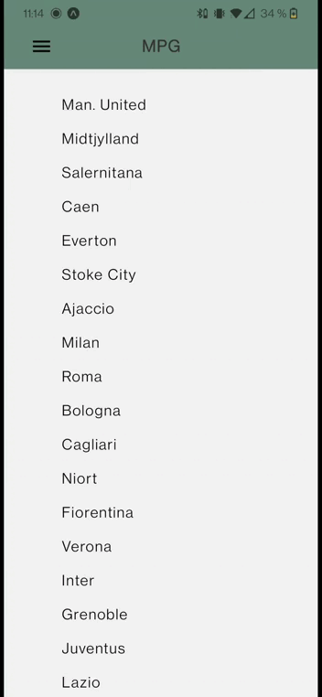

# Test technique pour Mon Petit gazon

# Pour lancer l'app :

1 - Clonez le repo
2 - npm install
3 - Petite modif à faire: 

Aller dans node_modules/react-navigation-drawer/lib/commonjs/view et trouver le fichier Drawer.js
Dans ce fichier, remplacez les deux instances de 'interpolate' par 'interpolateNode'

Après ça, expo start et tout devrais être ok !